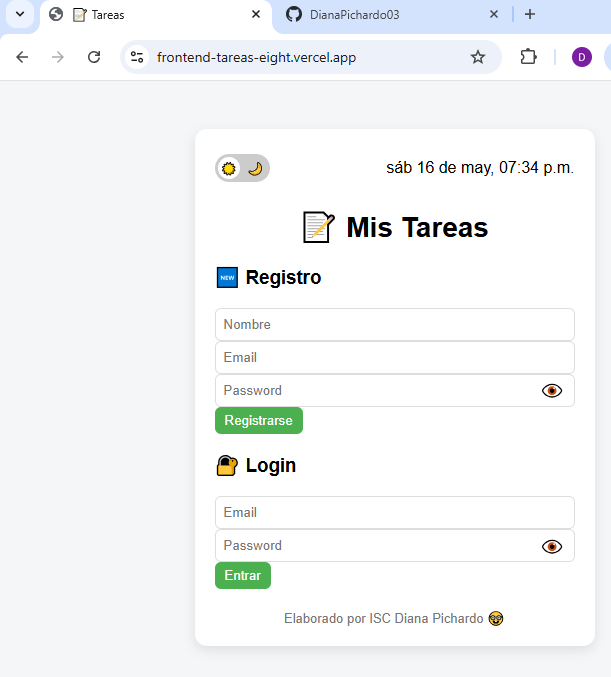
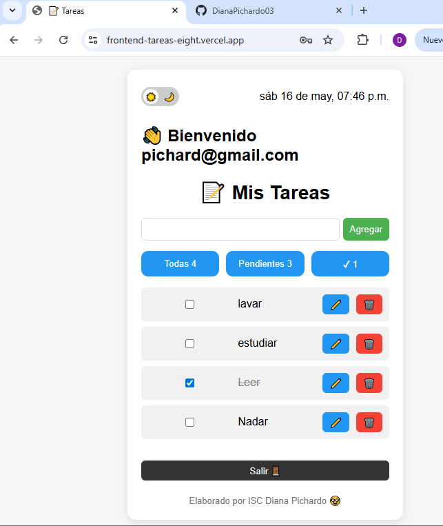
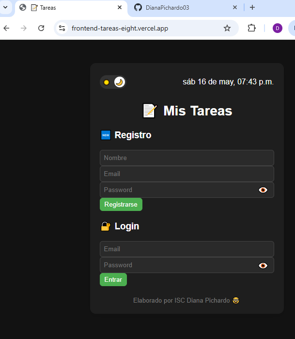

# 📝 Proyecto Tareas App Fullstack

Aplicación web fullstack para gestión de tareas con autenticación de usuarios, desarrollada con Node.js, Express y MySQL en el backend, y JavaScript Vanilla en el frontend.

La aplicación permite registrar usuarios, iniciar sesión con JWT, crear, editar, eliminar y filtrar tareas en tiempo real.

---

## 🚀 Demo en vivo

🔗 Frontend: https://frontend-tareas-eight.vercel.app/  
🔗 Backend API: https://backend-todo-3d74.onrender.com

---

## 🧠 Funcionalidades

- Registro de usuarios
- Inicio de sesión con JWT
- Autenticación segura
- Crear tareas
- Editar tareas
- Eliminar tareas
- Marcar tareas como completadas
- Filtros (todas / pendientes / completadas)
- Modo oscuro (dark mode)
- Persistencia de sesión con localStorage
- Interfaz dinámica sin recargar la página

---

## 🛠️ Tecnologías utilizadas

### Frontend
- HTML5
- CSS3
- JavaScript (Vanilla)

### Backend
- Node.js
- Express
- MySQL
- JWT (JSON Web Token)
- bcrypt.js
- CORS

### Deploy
- Frontend: Vercel
- Backend: Render
- Base de datos: Railway
- Control de versiones: Git + GitHub

---

## 🏗️ Arquitectura del proyecto

```txt id="arch1"
Frontend (Vercel)
   ↓ fetch (API REST)
Backend (Render - Express)
   ↓
Base de datos (Railway - MySQL)

## 🌐 API Endpoints

| Método | Endpoint | Descripción |
|--------|----------|-------------|
| POST | /api/auth/register | Registrar usuario |
| POST | /api/auth/login | Iniciar sesión |
| GET | /api/tasks | Obtener tareas |
| POST | /api/tasks | Crear tarea |
| PUT | /api/tasks/:id | Editar tarea |
| DELETE | /api/tasks/:id | Eliminar tarea |


## ⚙️ Instalación local

Clonar el repositorio:

```bash
git clone https://github.com/DianaPichardo03/backend-todo
```

Entrar a la carpeta del proyecto:

```bash
cd ProyectoTareas
```

Instalar dependencias del backend:

```bash
npm install
```

Iniciar servidor:

```bash
npm run dev
```

---

## 📸 Screenshots

### 🏠 Pantalla principal



### ✅ Gestión de tareas



### ☀️🌙 Modo


---

## 👨‍💻 Autor

Desarrollado por Diana Laura Pichardo García

- GitHub: https://github.com/DianaPichardo03